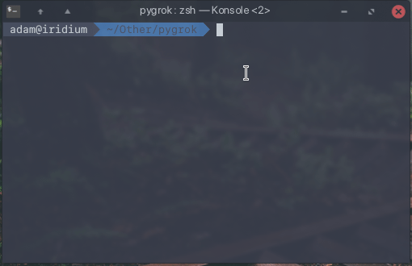

# pygrok

Pygrok is a set of tools for interacting with the ngrok web panel.
<br>
Currently it is an early release, which means it is rough around the edges. It hasn't been tested thoroughly yet so expect crashes and bugs.

## Getting started

### Prerequisites

* python-selenium
* python-ptable
* chromium/chrome

### Running

```
$ python pygrok-interactive.py
```

### Usage

Pygrok will prompt you to login on the first run and then save the cookie. Next it will cache the data from your account.
<br>
After these tasks have completed you are ready to use the data. You can use the 'ssh' command to connect to your server of choice.

### Demo

